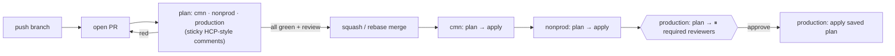

# Terraform on GitHub Actions — HCP-style runs, PR plans, gated applies

## POC quickstart for `annemshah-definely/gha-tf-demo`

Three commands from a terminal that has `git` and [`gh`](https://cli.github.com) logged in
(`gh auth login`). Nothing here needs cloud credentials — the demo environments use the
`random` provider.

```bash
# 1. put the files in the repo (replaces the default README, if any)
git clone https://github.com/annemshah-definely/gha-tf-demo && cd gha-tf-demo
unzip -o ~/Downloads/gha-tf-demo-poc.zip -d .
chmod +x scripts/*.sh
git checkout -B main && git add -A && git commit -m "Add Terraform pipeline (HCP-style plans, gated applies)" && git push -u origin main

# 2. configure GitHub: environments, production reviewer (you), merge settings, ruleset, variables
scripts/bootstrap-github.sh

# 3. open the first PR (touches nonprod + production; cmn shows as skipped) and watch the plan comments appear
scripts/open-demo-pr.sh
```

Then merge the PR (squash) and open the **Actions** tab: `cmn` and `nonprod` plan → apply on
their own, `production / apply` pauses for your approval with the rendered plan in the job summary.

> **Private repo note.** `gha-tf-demo` is private. On a personal account with GitHub Free, required
> reviewers, deployment branch policies and rulesets only work on **public** repos — the pipeline
> itself still runs, but the production gate and merge rules won't be enforced. The bootstrap
> script checks this and prints the one command to flip the repo to public for the POC.

The ruleset shipped here requires **0** approving reviews so a solo POC can merge; set
`required_approving_review_count` to 1+ in `.github/rulesets/main.json` and re-run the bootstrap
script once a team is involved.

---

Drop-in pipelines that give you the HCP Terraform workspace experience inside GitHub:

- **Speculative plan on every PR** — one sticky, colour-coded comment per environment
  (workspace) with collapsed per-resource diffs, change counts, outputs, drift and warnings.
- **Merge only when green** — a branch ruleset requires every `<env> / plan` check, keeps
  branches up to date, and allows squash/rebase merges only.
- **Promote on merge** — `cmn → nonprod → production`, each one `plan → apply` of the
  *exact* saved plan, with the `production` GitHub Environment holding the approval gate
  (reviewers read the rendered plan, then approve — HCP's "confirm & apply").

```
.github/
├── workflows/
│   ├── terraform.yml          # the pipeline: PR -> plans, main -> cmn -> nonprod -> production
│   ├── _terraform-plan.yml    # reusable: init / fmt / validate / plan + HCP-style PR comment
│   └── _terraform-apply.yml   # reusable: plan -> upload tfplan -> (environment gate) -> apply
├── scripts/
│   ├── render_plan.py         # terraform show (json + text) -> HCP-style Markdown panel
│   └── fixtures/              # sample plan output for local previews
├── rulesets/main.json         # importable branch ruleset (required checks, squash/rebase only)
└── dependabot.yml             # keeps actions + providers current
environments/{cmn,nonprod,production}/   # one root module per workspace (demo resource inside)
modules/                                 # shared modules
scripts/bootstrap-github.sh              # gh-based one-shot setup of environments / gates / ruleset / variables
scripts/open-demo-pr.sh                  # opens the first demo PR
```

## The flow



What a PR comment looks like (one per environment, updated in place on every push):

> ## 🟢 Terraform plan · production
> | Workspace | Status | Changes | Run | Commit | Triggered by |
> |:--|:--|:--|:--|:--|:--|
> | **production** `environments/production` | 🟢 **Planned** | `+3` `~1` `-2` `↓1` | #42 | `3f9c2a1` PR #87 | alice |
>
> ✅ init · ✅ fmt · ✅ validate · ✅ plan
>
> ### Resource changes
> 🟢 **3 to add** · 🟡 **1 to change** · 🔴 **2 to destroy** · 🟠 **1 to replace** · 🟣 **1 to import**
>
> ▸ 🟠 `aws_db_instance.main` <kbd>replace</kbd> forces replacement: engine_version  
> ▸ 🔴 `aws_iam_user.legacy` <kbd>destroy</kbd> no longer in configuration  
> ▸ 🟡 `aws_instance.web` <kbd>update in-place</kbd>  
> ▸ 🟢 `aws_s3_bucket.logs` <kbd>create</kbd>  
> ▸ 📤 Output changes · ⚠️ Drift · 1 object changed outside of Terraform

Each row expands into the resource diff rendered as a `diff` block, so GitHub colours
additions green, removals red and in-place updates orange — the same cues as the HCP run page.
The full, untruncated panel is also written to the job summary of every plan and apply.

## Setup (≈10 minutes, or `scripts/bootstrap-github.sh` for steps 2, 3 and 5)

1. **Copy** `.github/`, `environments/` and `modules/` into your repo. The demo environments use the
   `random` provider with local state, so the pipeline runs end-to-end *before* any cloud wiring:
   open a PR and you'll get the comments immediately. Replace `environments/*/main.tf` with your
   real root modules (backend block included) when ready.

2. **GitHub Environments** (Settings → Environments). Create `cmn`, `nonprod`, `production`.
   On `production` (and `nonprod` if you want): *Required reviewers* (up to 6; tick *Prevent
   self-review*), optional *Wait timer*, and *Deployment branches → Selected branches → `main`*.
   The apply job of each environment runs under the environment of the same name, so this is the
   only place approvals are configured.

3. **Repository variables** (Settings → Secrets and variables → Actions → Variables):

   | Variable | Purpose |
   |---|---|
   | `AWS_PLAN_ROLE_ARN_CMN` / `_NONPROD` / `_PRODUCTION` | read-only role for plans (PRs and the pre-approval plan on `main`) |
   | `AWS_APPLY_ROLE_ARN_CMN` / `_NONPROD` / `_PRODUCTION` | read/write role for applies |
   | `AWS_REGION` (optional) | defaults to `us-east-1` |
   | `TERRAFORM_VERSION` (optional) | defaults to `1.15.x` |

   Leave the role variables empty to skip AWS auth entirely (useful for the demo, or for other
   clouds — see *Customising*).

4. **OIDC trust policies** (no long-lived keys). The plan role trusts PR runs and `main`; the
   apply role trusts only the gated environment:

   ```json
   "Condition": {
     "StringEquals": { "token.actions.githubusercontent.com:aud": "sts.amazonaws.com" },
     "StringLike":   { "token.actions.githubusercontent.com:sub": [
       "repo:annemshah-definely/gha-tf-demo:pull_request",
       "repo:annemshah-definely/gha-tf-demo:ref:refs/heads/main"          // plan role
     ]}
   }
   ```
   ```json
   "StringLike": { "token.actions.githubusercontent.com:sub": "repo:annemshah-definely/gha-tf-demo:environment:production" }   // apply role
   ```
   The plan role needs read access to the state (and the resources being planned); it never
   takes the state lock (`-lock=false`). The apply role needs state read/write + lock.

5. **Branch ruleset** — Settings → Rules → Rulesets → *New ruleset* → *Import a ruleset* →
   `.github/rulesets/main.json`. It requires `cmn / plan`, `nonprod / plan`, `production / plan`,
   one approving review, up-to-date branches (so the plan you reviewed is the plan that gets
   applied) and squash/rebase merges only. Also untick *Allow merge commits* under
   Settings → General → Pull Requests. If GitHub shows the check names differently, copy them from
   the Checks tab of your first PR and edit the ruleset.

That's it. The first PR produces the three plan comments; the first merge runs the promotion.

## How it behaves

- **Untouched environments are skipped on PRs.** `terraform.yml` maps changed files to
  environments; anything outside `environments/<env>/` (modules, workflows, scripts) is treated as
  affecting every environment. A skipped plan reports *skipped*, which satisfies the required check.
  If detection fails, everything is planned (fail loud, never fail open).
- **No changes → no approval request.** The apply job is skipped when the plan is empty.
- **Exact-plan applies.** The reviewed plan file is applied; if state moved in between,
  Terraform refuses (`Saved plan is stale`) and the run goes red instead of applying something else.
- **Concurrency.** A newer push to a PR cancels its in-flight plans. Runs on `main` are
  serialised so promotions never interleave.
- **Formatting.** `terraform fmt -check` failures still produce the plan (so reviewers see the
  changes) but fail the job and show the diff in the panel.
- **Merge queue ready.** Plans also run on `merge_group`; no comment is posted there.

## Customising

- **Other clouds.** Swap the `Configure AWS credentials (OIDC)` step in both reusable workflows for
  `azure/login` / `google-github-actions/auth`, and rename the role inputs. Everything else is
  cloud-agnostic.
- **Backend / var files.** Pass `init-args: -backend-config=...` and `plan-args: -var-file=...`
  from `terraform.yml` (both reusable workflows accept them).
- **Parallel instead of promoted applies.** Remove the `needs:` lines on `apply-nonprod` /
  `apply-production`.
- **More environments.** See `environments/README.md`.
- **Comment / summary sizing.** Limits live at the top of `render_plan.py`
  (`COMMENT_LIMIT`, `COMMENT_RESOURCE_LINES`, ...). Comments stay under GitHub's 65k limit by
  expanding diffs in plan order and collapsing the rest to one-line rows.
- **Preview the panel locally** (handy when tweaking the renderer):
  ```bash
  python3 .github/scripts/render_plan.py --environment production --working-directory environments/production \
    --plan-json .github/scripts/fixtures/plan.json --plan-txt .github/scripts/fixtures/plan.txt \
    --stage init=success --stage fmt=success --stage validate=success --stage plan=success \
    --comment-out /tmp/comment.md
  ```
  Against a real plan: `terraform show -json tfplan > plan.json && terraform show -no-color tfplan > plan.txt`.

## Security notes

- `tfplan` (uploaded for the apply job) and `plan.json` can contain sensitive values. `plan.json`
  never leaves the runner; `tfplan` is uploaded with 1-day retention and is readable by anyone who
  can read workflow runs. If that's too much for your threat model, re-plan inside the gated apply
  job instead of downloading the artifact (you lose the exact-plan guarantee).
- Fork PRs get no secrets/OIDC and cannot comment; use branches in the same repository.
- The rendered diff is Terraform's own output, so anything Terraform prints (`(sensitive value)`
  is masked, plain strings are not) ends up in the PR comment, like it would in HCP's UI.
